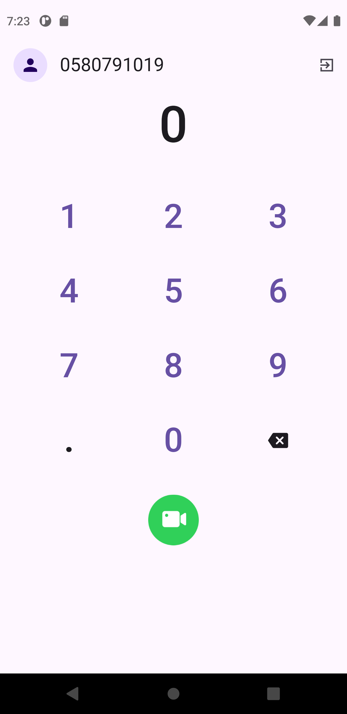
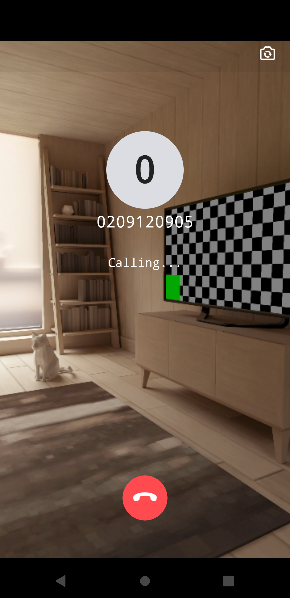
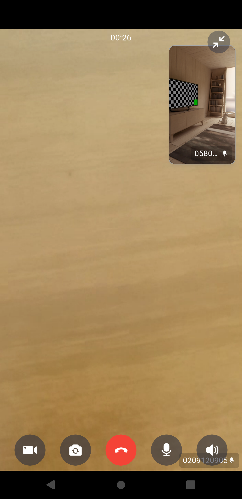
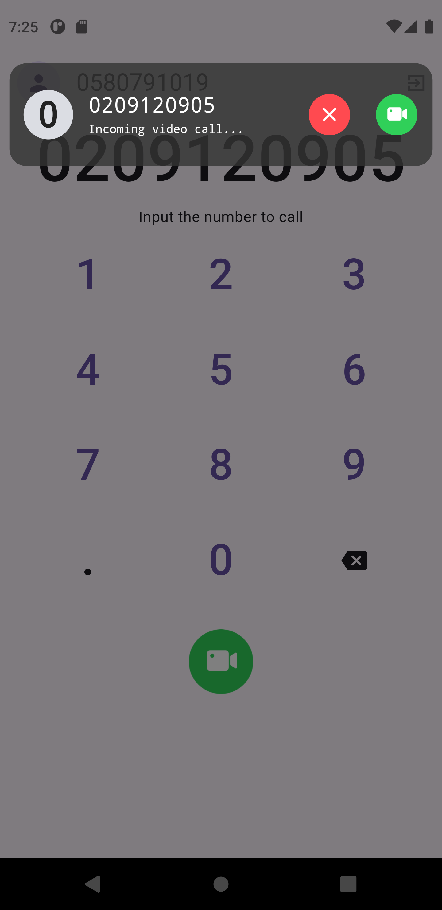
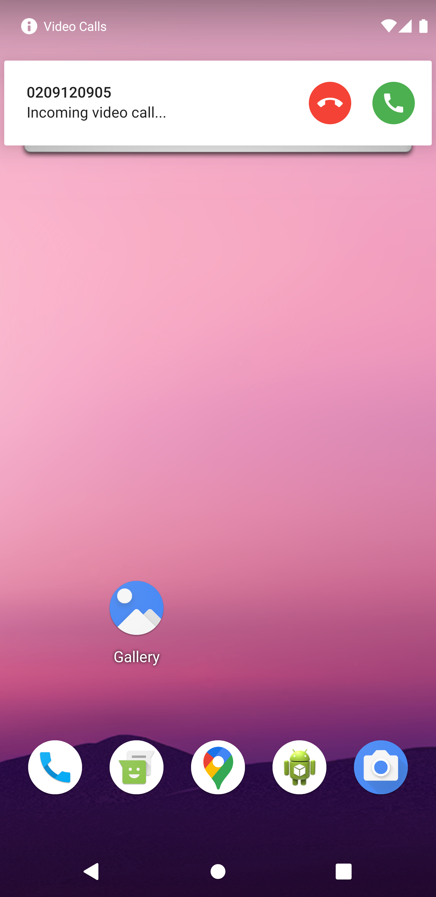

# Video Calls

Flutter app that allows two people to join a video call.
Call Notification hit receiver phone both when it is in foreground, background and terminated.
Zego Cloud Library Used (Calls & UI Kit) used.

## Screenshots

 

